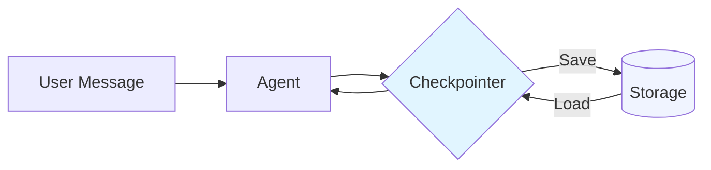
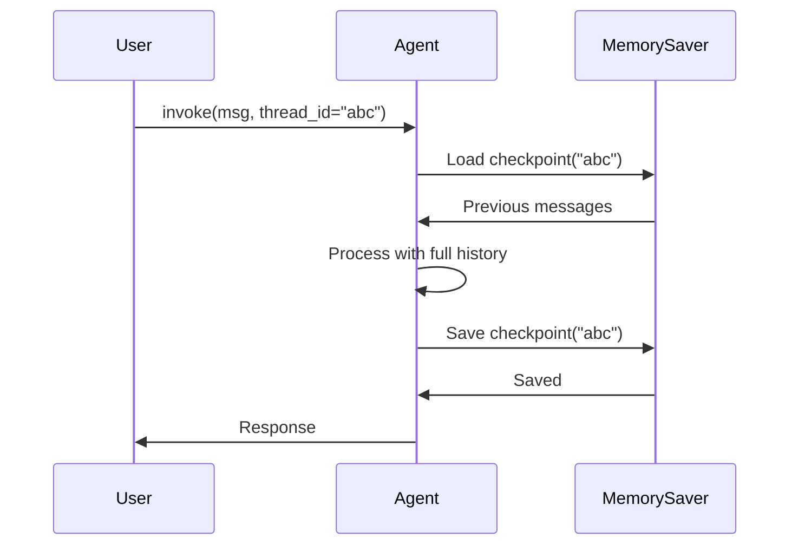

# Module 04: Memory and State Management

In this module, you will understand and implement memory in your agent - the feature that transforms a simple chatbot into a persistent conversational AI like Claude, Gemini, and ChatGPT.

## Learning Objectives

By the end of this module, you will:
- Understand **why** agents need memory and **what** checkpointing actually does
- See the problem of stateless agents firsthand
- Implement in-memory persistence with `MemorySaver`
- Use persistent storage with `SqliteSaver`
- Manage multiple conversation threads
- Know when to use which memory solution

## The Problem: Stateless Agents

Let's start by understanding the problem. Run this code with an agent from Module 03:

```python
# No checkpointer = stateless
agent = graph.compile()  # No checkpointer!

# Turn 1
result = agent.invoke({
    "messages": [HumanMessage(content="My name is Alice")]
})
print(result["messages"][-1].content)
# "Nice to meet you, Alice!"

# Turn 2
result = agent.invoke({
    "messages": [HumanMessage(content="What's my name?")]
})
print(result["messages"][-1].content)
# "I don't have information about your name."
```

**The agent forgot!** Why? Because each `invoke()` is completely independent - the agent has no memory of previous conversations.

### Manual Solution (The Hard Way)

Before LangGraph checkpointing, you had to manually manage history:

```python
# Manually maintain message list
messages = []

# Turn 1
messages.append(HumanMessage(content="My name is Alice"))
result = agent.invoke({"messages": messages})
messages = result["messages"]  # Update with response

# Turn 2
messages.append(HumanMessage(content="What's my name?"))
result = agent.invoke({"messages": messages})
messages = result["messages"]  # Update again
```

**Problems:**
- 😫 You manage state manually
- 😫 State only lives in memory (lost on restart)
- 😫 No way to handle multiple users
- 😫 No recovery if process crashes

**LangGraph checkpointers solve all of this!**

## What is Checkpointing?

**Checkpointing** is LangGraph's built-in state persistence system. Think of it like Git for your agent's memory.



### What Gets Saved in a Checkpoint?

Each checkpoint contains:

1. **Messages** - Full conversation history
2. **State** - Any custom state fields
3. **Metadata** - Step number, timestamp, parent checkpoint
4. **Next nodes** - Which nodes to run next (if paused)

### The Thread Concept

A **thread** is a unique conversation identifier. Think of it like a chat room ID:

```
Thread "alice-123"          Thread "bob-456"
├── Message 1: Hi           ├── Message 1: Hello
├── Message 2: My name...   ├── Message 2: I need...
└── Message 3: What's...    └── Message 3: Can you...
```

Each thread maintains its own independent conversation history using the same agent.

## Checkpointer Types: Choose Your Storage

| Type | Persistence | Use Case | Setup |
|------|-------------|----------|-------|
| **MemorySaver** | In-process only | Development, testing | No setup needed |
| **SqliteSaver** | Local file | Desktop apps, prototypes | SQLite file |
| **PostgresSaver** | Database | Production, multi-server | PostgreSQL server |

### When to Use Each?

```
Development → MemorySaver (fastest iteration)
    ↓
Local App → SqliteSaver (no server needed)
    ↓
Production → PostgresSaver (scalable)
```

## Implementing MemorySaver

Perfect for development - conversations persist during runtime:

```python
from langgraph.checkpoint.memory import MemorySaver

# Step 1: Create checkpointer
memory = MemorySaver()

# Step 2: Compile with checkpointer
agent = graph.compile(checkpointer=memory)

# Step 3: Use with thread_id in config
config = {"configurable": {"thread_id": "conversation-1"}}

# Turn 1
agent.invoke(
    {"messages": [HumanMessage(content="My name is Alice")]},
    config=config
)

# Turn 2 - Agent remembers because same thread_id!
result = agent.invoke(
    {"messages": [HumanMessage(content="What's my name?")]},
    config=config
)

print(result["messages"][-1].content)
# "Your name is Alice!"
```

### How It Works Internally



**Key insight:** You only pass NEW messages, but the agent sees ALL messages because the checkpointer loads previous history.

## Multi-User Conversations with Threads

One agent, many conversations:

```python
memory = MemorySaver()
agent = graph.compile(checkpointer=memory)

# Alice's conversation
alice_config = {"configurable": {"thread_id": "alice"}}
agent.invoke(
    {"messages": [HumanMessage(content="I love Python")]},
    config=alice_config
)

# Bob's conversation (completely separate)
bob_config = {"configurable": {"thread_id": "bob"}}
agent.invoke(
    {"messages": [HumanMessage(content="I love JavaScript")]}, 
    config=bob_config
)

# Query Alice - remembers Python
result = agent.invoke(
    {"messages": [HumanMessage(content="What do I love?")]},
    config=alice_config
)
# "You love Python!"

# Query Bob - remembers JavaScript
result = agent.invoke(
    {"messages": [HumanMessage(content="What do I love?")]},
    config=bob_config
)
# "You love JavaScript!"
```

**Mental model:** Thread IDs are like separate browser tabs - each has its own session.

## SqliteSaver: Persistent Storage

MemorySaver loses data on restart. For persistence:

```python
from langgraph.checkpoint.sqlite import SqliteSaver

# Create persistent checkpointer
with SqliteSaver.from_conn_string("agent_memory.db") as checkpointer:
    agent = graph.compile(checkpointer=checkpointer)
    
    config = {"configurable": {"thread_id": "persistent-user"}}
    
    result = agent.invoke(
        {"messages": [HumanMessage(content="Remember: my API key is 12345")]},
        config=config
    )

# Restart your app...
# The conversation is still there!

with SqliteSaver.from_conn_string("agent_memory.db") as checkpointer:
    agent = graph.compile(checkpointer=checkpointer)
    
    config = {"configurable": {"thread_id": "persistent-user"}}
    
    result = agent.invoke(
        {"messages": [HumanMessage(content="What's my API key?")]},
        config=config
    )
    print(result["messages"][-1].content)
    # "Your API key is 12345"
```

### For Async Applications

```python
from langgraph.checkpoint.sqlite.aio import AsyncSqliteSaver

async with AsyncSqliteSaver.from_conn_string("agent_memory.db") as checkpointer:
    agent = graph.compile(checkpointer=checkpointer)
    result = await agent.ainvoke({"messages": [...]}, config=config)
```

## Inspecting and Debugging State

Check what's in memory:

```python
# Get current state snapshot
state = agent.get_state(config)

print(f"Messages: {len(state.values['messages'])}")
print(f"Next nodes: {state.next}")
print(f"Checkpoint ID: {state.config['configurable']['checkpoint_id']}")

# View conversation history
for msg in state.values["messages"]:
    role = type(msg).__name__
    print(f"{role}: {msg.content[:50]}...")
```

### Viewing State History

See all checkpoints (like Git history):

```python
for state in agent.get_state_history(config):
    step = state.metadata.get("step", 0)
    msg_count = len(state.values.get("messages", []))
    print(f"Step {step}: {msg_count} messages")
```

## Managing Context Windows

LLMs have token limits. Trim old messages:

### Manual Trimming

```python
from langchain_core.messages import SystemMessage

def create_trimming_node(state):
    """Keep system message + last 10 messages."""
    messages = state["messages"]
    
    if len(messages) > 11:
        system = [m for m in messages if isinstance(m, SystemMessage)]
        others = [m for m in messages if not isinstance(m, SystemMessage)]
        messages = system + others[-10:]
    
    return {"messages": messages}
```

### Built-in Trimmer

```python
from langchain_core.messages import trim_messages

trimmed = trim_messages(
    messages,
    max_tokens=4000,      # Token budget
    strategy="last",       # Keep most recent
    token_counter=llm,     # Count actual tokens
)
```

## Real-World Use Cases

| Scenario | Checkpointer | Thread Strategy |
|----------|--------------|-----------------|
| Development/Testing | MemorySaver | Single thread |
| Customer support bot | PostgresSaver | Thread per ticket |
| Personal AI assistant | SqliteSaver | Thread per day/week |
| Multi-tenant SaaS | PostgresSaver | Thread per user session |
| Jupyter notebook demo | MemorySaver | Thread per cell execution |

## Common Patterns

### Pattern 1: Session-based Threading

```python
import time

thread_id = f"session-{int(time.time())}"
config = {"configurable": {"thread_id": thread_id}}
```

### Pattern 2: User-based Threading

```python
def get_user_config(user_id: str, conversation_id: str):
    return {
        "configurable": {
            "thread_id": f"user-{user_id}-conv-{conversation_id}"
        }
    }
```

### Pattern 3: Time-based Threading

```python
from datetime import datetime

thread_id = f"user-{user_id}-{datetime.now().strftime('%Y-%m-%d')}"
config = {"configurable": {"thread_id": thread_id}}
```

## Comparison Table

|  | No Memory | MemorySaver | SqliteSaver |
|--|-----------|-------------|-------------|
| **Persistence** | None | Process lifetime | Survives restarts |
| **Multi-user** | ❌ | ✅ | ✅ |
| **Overhead** | None | Low | Medium |
| **Setup** | None | 1 line | 1 line + DB file |
| **Best for** | Stateless ops | Development | Production apps |

## Complete Code

See [code/04_memory.py](code/04_memory.py) for working examples demonstrating:
- Agent without memory (the problem)
- Agent with MemorySaver
- Multi-threaded conversations
- State inspection
- SqliteSaver usage

## Troubleshooting

### Issue: "Agent not remembering"

**Check:**
1. ✓ Same `thread_id` across calls?
2. ✓ Checkpointer passed to `compile()`?
3. ✓ Using `config` parameter in `invoke()`?

### Issue: "Context window exceeded"

**Solutions:**
- Implement message trimming
- Use shorter thread lifetimes
- Summarize old conversations

### Issue: "Database locked" (SqliteSaver)

**Cause:** Multiple processes accessing same SQLite file

**Solution:** Use PostgresSaver for multi-process apps

## Key Takeaways

1. **Checkpointing = Automatic history management**
2. **Thread ID = Conversation identifier**
3. **MemorySaver = Development, SqliteSaver = Production**
4. **One agent, many threads = Multi-user support**
5. **State is saved automatically after each invoke**

## Exercises

1. **Before/After**: Run the same agent with and without checkpointing - observe the difference
2. **Multi-user chat**: Build a CLI that handles multiple users (different thread IDs)
3. **Persistence test**: Use SqliteSaver, restart your app, verify conversation persists
4. **State inspector**: Create a function that prints formatted conversation history

## Next Steps

In [Module 05](05_advanced_patterns.md), we'll explore advanced patterns like human-in-the-loop (pausing execution), multi-agent coordination, and sophisticated error handling.

---

[Back to README](README.md) | [Previous: Tools](03_tools.md) | [Next: Advanced Patterns](05_advanced_patterns.md)
