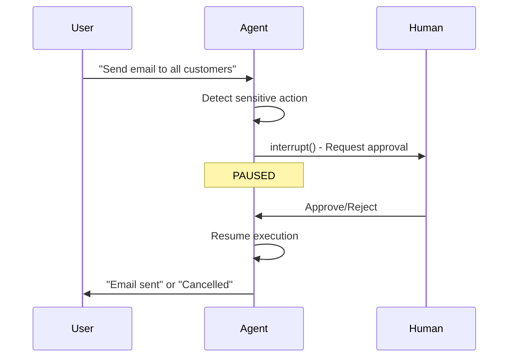
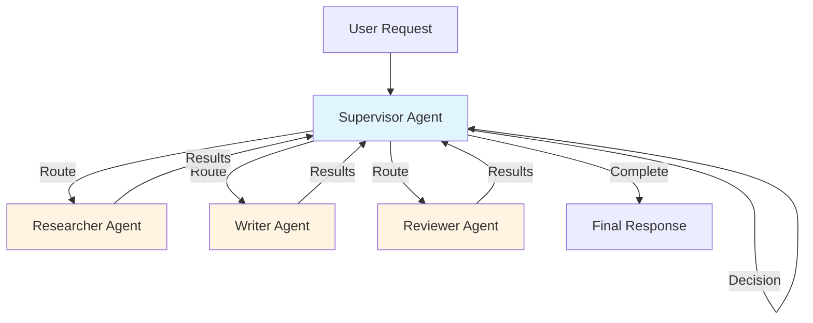

# Module 05: Advanced Agent Patterns

In this module, you'll learn the advanced patterns that separate toy demos from production AI systems. These are the techniques used by Claude, ChatGPT, and Gemini to handle complex workflows, maintain safety, and coordinate multiple capabilities.

## Prerequisites

Before starting this module:
- ✅ **Modules 02-04 completed**: Understand basic agents, tools, and memory
- ✅ **Comfortable with async/await**: Some patterns use async

> **Production Note:** This module focuses on core patterns. In **Module 06**, you'll learn how to add streaming, observability, and other production features to these patterns.

## Learning Objectives

By the end of this module, you will:
- Understand **when and why** to use each advanced pattern
- Implement human-in-the-loop (HITL) for sensitive actions
- Build multi-agent systems with supervisor coordination
- Handle errors gracefully with retry strategies  
- Create modular, reusable components with subgraphs
- Execute tools in parallel for better performance

## Why "Advanced" Patterns Matter

So far, you've built an agent that can:
- Chat with users (Module 02)
- Call tools (Module 03)
- Remember conversations (Module 04)

But real-world AI systems need to handle:
- 🚫 **Irreversible actions** - sending emails, making purchases, deleting data
- 🔀 **Complex workflows** - research → write → review → publish
- 💥 **Failures** - APIs go down, rate limits hit, network timeouts
- 📦 **Reusability** - same logic used in multiple places
- ⚡ **Performance** - parallel execution when possible

These patterns solve those problems.

---

## Pattern 1: Human-in-the-Loop (HITL)

### The Problem

Imagine your agent decides to:
- Send an email to 10,000 customers
- Delete a production database
- Make a $5,000 purchase

**Without HITL**, the agent executes immediately. **With HITL**, it pauses and asks for your approval.

### Real-World Use Cases

| Industry | HITL Example |
|----------|--------------|
| E-commerce | Approve refunds over $500 |
| Healthcare | Verify diagnosis before prescription |
| Finance | Confirm trades before execution |
| DevOps | Approve production deployments |
| Legal | Review contracts before sending |

### How HITL Works



### Implementation with interrupt()

```python
from langgraph.types import interrupt

def send_email_node(state: AgentState) -> dict:
    """Send email with human approval."""
    messages = state["messages"]
    last_msg = messages[-1]
    
    # Detect if we're about to send email
    if "send email" in last_msg.content.lower():
        # PAUSE and ask human
        approval = interrupt({
            "type": "approval_needed",
            "action": "send_email",
            "recipient": "extracted from context",
            "subject": "extracted from context",
            "body": "email content"
        })
        
        # Human rejected
        if not approval.get("approved"):
            return {"messages": [AIMessage(
                content="Email cancelled by user."
            )]}
    
    # Human approved or no approval needed
    result = actually_send_email(...)
    return {"messages": [AIMessage(content=f"Email sent: {result}")]}
```

### Resuming After Interrupt

```python
from langgraph.types import Command

# Step 1: Initial invocation
result = agent.invoke(
    {"messages": [HumanMessage(content="Send email to john@example.com")]},
    config={"configurable": {"thread_id": "session-1"}}
)

# Step 2: Check if paused
if result.get("__interrupt__"):
    print("PAUSED:", result["__interrupt__"])
    
    # Step 3: Get human decision
    user_input = input("Approve? (yes/no): ")
    
    # Step 4: Resume with decision
    result = agent.invoke(
        Command(resume={"approved": user_input == "yes"}),
        config={"configurable": {"thread_id": "session-1"}}
    )

print("Final result:", result["messages"][-1].content)
```

### Key Concepts

**interrupt() returns data TO the human** - Show them what needs approval

**Command(resume=...) passes data FROM the human** - Their decision

**Same thread_id required** - Agent remembers the paused state

---

## Pattern 2: Multi-Agent Systems

### The Problem

Some tasks are too complex for a single agent. For example:

**Task**: "Write a technical blog post about quantum computing"

A single agent would try to do everything at once. Better to split:
1. **Researcher** - Gathers information
2. **Writer** - Creates content
3. **Reviewer** - Checks quality
4. **Supervisor** - Coordinates the workflow

### Architecture



### Why This Pattern?

1. **Specialization** - Each agent is expert in one thing
2. **Clear responsibilities** - No confusion about who does what
3. **Reusability** - Use the researcher in other workflows
4. **Easier to debug** - Know which agent failed
5. **Parallel work** - (Advanced) Multiple agents work simultaneously

### Supervisor Implementation

```python
from typing import Literal

class WorkflowState(TypedDict):
    """State for multi-agent workflow."""
    messages: Annotated[list[BaseMessage], add_messages]
    next_agent: str  # Which agent to invoke next

# Define specialized agents
def researcher_node(state: WorkflowState) -> dict:
    """Research agent - gathers information."""
    messages = state["messages"]
    
    research_llm = ChatOpenAI(temperature=0)
    response = research_llm.invoke([
        SystemMessage(content=(
            "You are a research agent. Your job is to gather accurate "
            "information and facts about the topic. Cite sources."
        )),
        *messages
    ])
    
    return {"messages": [AIMessage(
        content=f"[RESEARCH] {response.content}",
        name="Researcher"
    )]}


def writer_node(state: WorkflowState) -> dict:
    """Writer agent - creates content."""
    messages = state["messages"]
    
    writer_llm = ChatOpenAI(temperature=0.7)  # More creative
    response = writer_llm.invoke([
        SystemMessage(content=(
            "You are a writer agent. Create engaging, well-structured "
            "content based on the research provided."
        )),
        *messages
    ])
    
    return {"messages": [AIMessage(
        content=f"[DRAFT] {response.content}",
        name="Writer"
    )]}


def reviewer_node(state: WorkflowState) -> dict:
    """Reviewer agent - quality check."""
    messages = state["messages"]
    
    reviewer_llm = ChatOpenAI(temperature=0)
    response = reviewer_llm.invoke([
        SystemMessage(content=(
            "You are a reviewer agent. Check the draft for accuracy, "
            "clarity, and completeness. Suggest improvements."
        )),
        *messages
    ])
    
    return {"messages": [AIMessage(
        content=f"[REVIEW] {response.content}",
        name="Reviewer"
    )]}


def supervisor_node(state: WorkflowState) -> dict:
    """Supervisor decides which agent to call next."""
    messages = state["messages"]
    
    supervisor_llm = ChatOpenAI(temperature=0)
    response = supervisor_llm.invoke([
        SystemMessage(content="""You are a supervisor coordinating a team.
        
        Based on the conversation, decide the next step:
        - 'researcher' if we need more information
        - 'writer' if we're ready to create content
        - 'reviewer' if we have a draft to review
        - 'FINISH' if the task is complete
        
        Respond with ONLY the agent name."""),
        *messages
    ])
    
    next_agent = response.content.strip().lower()
    return {"next_agent": next_agent}


# Routing function
def route_to_agent(state: WorkflowState) -> Literal["researcher", "writer", "reviewer", "__end__"]:
    """Route based on supervisor's decision."""
    next_agent = state.get("next_agent", "").lower()
    
    if next_agent == "finish":
        return "__end__"
    elif next_agent in ["researcher", "writer", "reviewer"]:
        return next_agent
    else:
        return "__end__"


# Build the graph
graph = StateGraph(WorkflowState)

graph.add_node("supervisor", supervisor_node)
graph.add_node("researcher", researcher_node)
graph.add_node("writer", writer_node)
graph.add_node("reviewer", reviewer_node)

# Start with supervisor
graph.add_edge(START, "supervisor")

# Supervisor routes to agents
graph.add_conditional_edges(
    "supervisor",
    route_to_agent,
    {
        "researcher": "researcher",
        "writer": "writer",
        "reviewer": "reviewer",
        "__end__": END
    }
)

# All agents return to supervisor
graph.add_edge("researcher", "supervisor")
graph.add_edge("writer", "supervisor")
graph.add_edge("reviewer", "supervisor")

multi_agent = graph.compile()
```

### Execution Flow Example

```
User: "Write a blog post about LangGraph"
  ↓
Supervisor: → researcher
  ↓
Researcher: [Gathers info about LangGraph]
  ↓
Supervisor: → writer
  ↓
Writer: [Creates draft blog post]
  ↓
Supervisor: → reviewer
  ↓
Reviewer: [Suggests improvements]
  ↓
Supervisor: → writer (for revisions)
  ↓
Writer: [Revises draft]
  ↓
Supervisor: → FINISH
```

---

## Pattern 3: Error Handling and Retries

### The Problem

APIs fail. Networks timeout. Rate limits hit. Your agent needs to handle these gracefully.

**Bad approach:**
```python
result = call_external_api()  # Crashes if API is down
```

**Good approach:**
```python
result = call_with_retry_and_fallback(call_external_api)  # Handles failures
```

### Retry with Exponential Backoff

```python
import time
from functools import wraps

def retry_with_backoff(max_retries: int = 3, base_delay: float = 1.0):
    """Decorator that retries with exponential backoff.
    
    Delay pattern: 1s → 2s → 4s → 8s
    """
    def decorator(func):
        @wraps(func)
        def wrapper(*args, **kwargs):
            last_exception = None
            
            for attempt in range(max_retries):
                try:
                    return func(*args, **kwargs)
                except Exception as e:
                    last_exception = e
                    
                    if attempt < max_retries - 1:
                        delay = base_delay * (2 ** attempt)
                        print(f"Attempt {attempt + 1} failed: {e}")
                        print(f"Retrying in {delay}s...")
                        time.sleep(delay)
            
            # All retries exhausted
            raise last_exception
        return wrapper
    return decorator


# Usage
@retry_with_backoff(max_retries=3, base_delay=1.0)
def call_unreliable_api(query: str) -> str:
    """This might fail randomly."""
    response = requests.get(f"https://api.example.com?q={query}")
    response.raise_for_status()
    return response.json()
```

### Error Categorization

Not all errors should be retried:

```python
from requests.exceptions import Timeout, ConnectionError
from openai import RateLimitError, AuthenticationError

def smart_error_handler(state: AgentState) -> dict:
    """Handle different error types appropriately."""
    try:
        result = process_request(state)
        return {"messages": [AIMessage(content=result)]}
        
    except RateLimitError:
        # Retry makes sense
        return {"messages": [AIMessage(
            content="Service is busy. Retrying in a moment..."
        )]}
        
    except AuthenticationError:
        # Don't retry - needs user action
        return {"messages": [AIMessage(
            content="Authentication error. Please check your API key."
        )]}
        
    except Timeout:
        # Retry with longer timeout
        return {"messages": [AIMessage(
            content="Request timed out. Trying again..."
        )]}
        
    except Exception as e:
        # Unknown error - log and notify
        logger.error(f"Unexpected error: {e}", exc_info=True)
        return {"messages": [AIMessage(
            content="An unexpected error occurred. Our team has been notified."
        )]}
```

### Circuit Breaker Pattern

Stop trying if service is consistently down:

```python
class CircuitBreaker:
    """Prevent cascading failures."""
    
    def __init__(self, failure_threshold: int = 5, timeout: int = 60):
        self.failure_threshold = failure_threshold
        self.timeout = timeout
        self.failures = 0
        self.last_failure_time = None
        self.state = "CLOSED"  # CLOSED, OPEN, HALF_OPEN
    
    def call(self, func, *args, **kwargs):
        """Call function with circuit breaker protection."""
        if self.state == "OPEN":
            if time.time() - self.last_failure_time > self.timeout:
                self.state = "HALF_OPEN"
            else:
                raise Exception("Circuit breaker is OPEN")
        
        try:
            result = func(*args, **kwargs)
            self.on_success()
            return result
        except Exception as e:
            self.on_failure()
            raise e
    
    def on_success(self):
        """Reset on successful call."""
        self.failures = 0
        self.state = "CLOSED"
    
    def on_failure(self):
        """Track failures."""
        self.failures += 1
        self.last_failure_time = time.time()
        
        if self.failures >= self.failure_threshold:
            self.state = "OPEN"
```

---

## Pattern 4: Subgraphs for Modularity

###The Problem

You have a "research workflow" that you want to use in multiple places:
- Blog post writer needs research
- Email responder needs research
- Report generator needs research

**Without subgraphs:** Copy-paste code everywhere (bad!)

**With subgraphs:** Define once, reuse everywhere

### Creating a Subgraph

```python
from langgraph.graph import StateGraph, START, END

class ResearchState(TypedDict):
    """State for research subgraph."""
    query: str
    results: str

def search_node(state: ResearchState) -> dict:
    """Search for information."""
    query = state["query"]
    # Simulate search
    results = f"Research results for: {query}"
    return {"results": results}

def summarize_node(state: ResearchState) -> dict:
    """Summarize findings."""
    results = state["results"]
    summary = f"Summary: {results[:100]}..."
    return {"results": summary}

def build_research_subgraph():
    """Reusable research component."""
    subgraph = StateGraph(ResearchState)
    
    subgraph.add_node("search", search_node)
    subgraph.add_node("summarize", summarize_node)
    
    subgraph.add_edge(START, "search")
    subgraph.add_edge("search", "summarize")
    subgraph.add_edge("summarize", END)
    
    return subgraph.compile()
```

### Using the Subgraph

```python
# Build the reusable component
research_subgraph = build_research_subgraph()

# Use it in main graph
main_graph = StateGraph(MainState)

# Add subgraph as a node!
main_graph.add_node("do_research", research_subgraph)
main_graph.add_node("write_response", response_node)

main_graph.add_edge(START, "do_research")
main_graph.add_edge("do_research", "write_response")
main_graph.add_edge("write_response", END)

agent = main_graph.compile()
```

---

## Pattern 5: Parallel Tool Execution

### The Problem

User asks: "What's the weather in NYC and Tokyo, and calculate 25 * 34?"

**Sequential execution:** Weather NYC (2s) → Weather Tokyo (2s) → Calculate (0.1s) = **4.1s total**

**Parallel execution:** All three at once = **2s total** ⚡

### Implementation

```python
from langgraph.constants import Send

def parallel_tool_node(state: AgentState):
    """Execute multiple tools in parallel."""
    messages = state["messages"]
    last_msg = messages[-1]
    
    # Check if LLM requested multiple tools
    if hasattr(last_msg, "tool_calls") and len(last_msg.tool_calls) > 1:
        # Send each tool call to parallel execution
        return [
            Send("execute_single_tool", {"tool_call": tc})
            for tc in last_msg.tool_calls
        ]
    
    # Single tool or no tools
    return {"messages": messages}
```

---

## Pattern Comparison

| Pattern | Solves | Adds Complexity | When to Use |
|---------|--------|----------------|-------------|
| **HITL** | Safety, control | Medium | Irreversible actions |
| **Multi-Agent** | Complex workflows | High | Specialized tasks |
| **Retry** | Transient failures | Low | External APIs |
| **Subgraphs** | Code reuse | Low | Repeated logic |
| **Parallel** | Performance | Medium | Independent operations |

## Complete Code

See [code/05_advanced_patterns.py](code/05_advanced_patterns.py) for working demonstrations of all patterns.

## Real-World Combinations

In production, you often combine patterns:

```
HITL + Retry: "Approve this action, then retry if it fails"
Multi-Agent + Subgraphs: "Each agent uses shared research subgraph"
Multi-Agent + Error Handling: "If writer fails, route to backup agent"
```

## Exercises

1. **HITL Email**: Build agent that drafts emails and requires approval before sending
2. **Research Team**: Create researcher + writer + reviewer multi-agent system
3. **Resilient API**: Add retry logic with circuit breaker to a tool
4. **Parallel Weather**: Fetch weather for 5 cities in parallel

## Next Steps

In [Module 06](06_production.md), we bring it all together with production features: streaming, async patterns, and observability.

---

[Back to README](README.md) | [Previous: Memory](04_memory.md) | [Next: Production](06_production.md)
