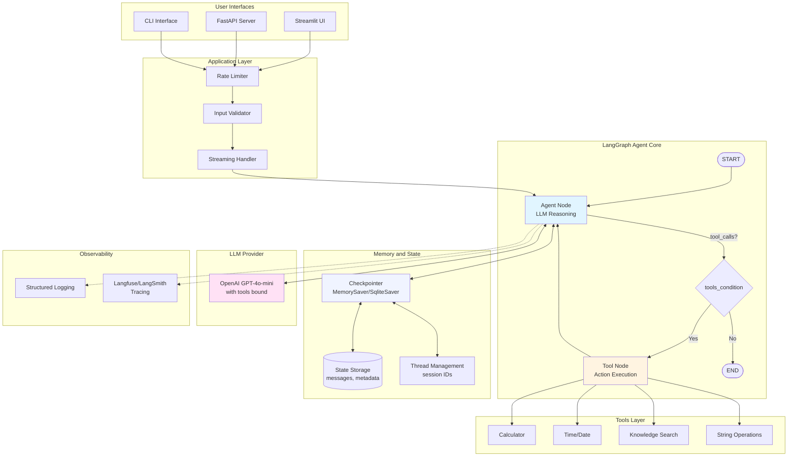
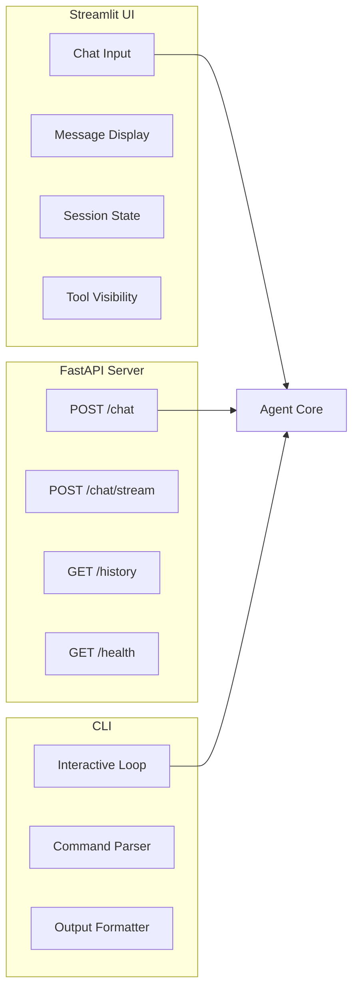
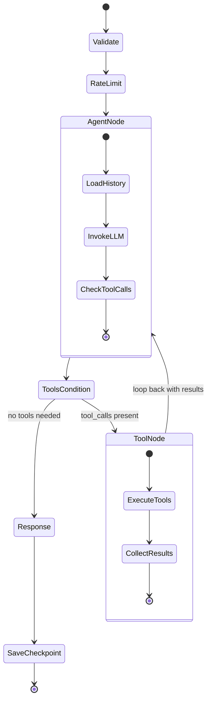
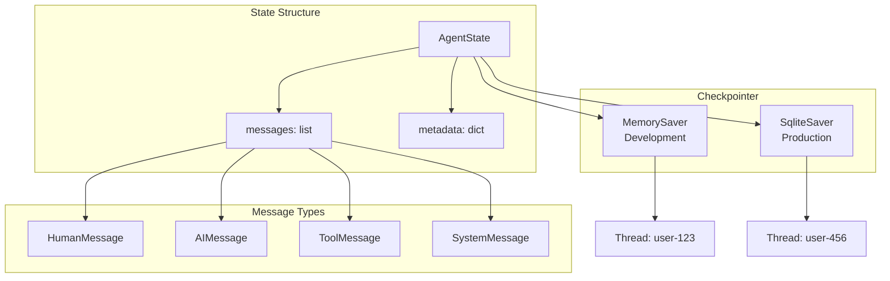
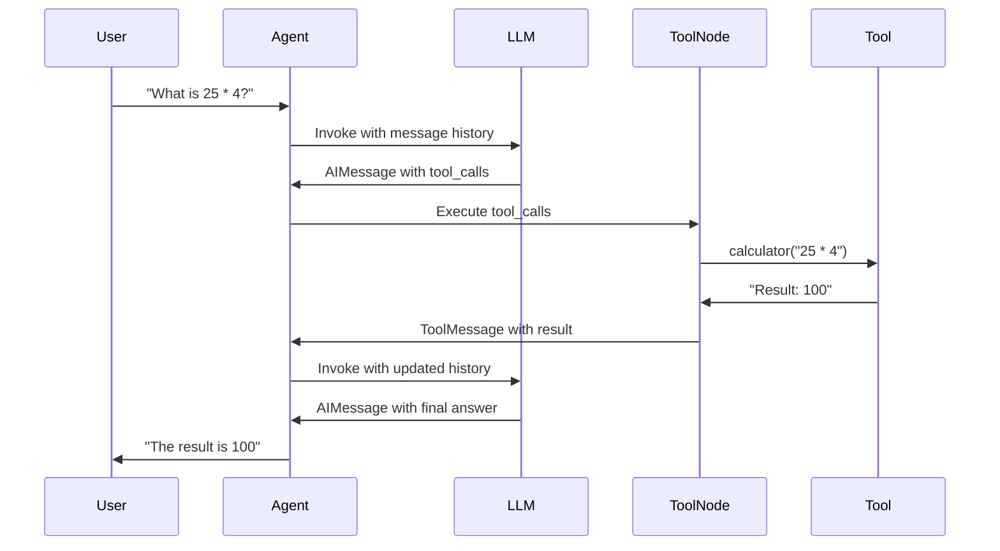
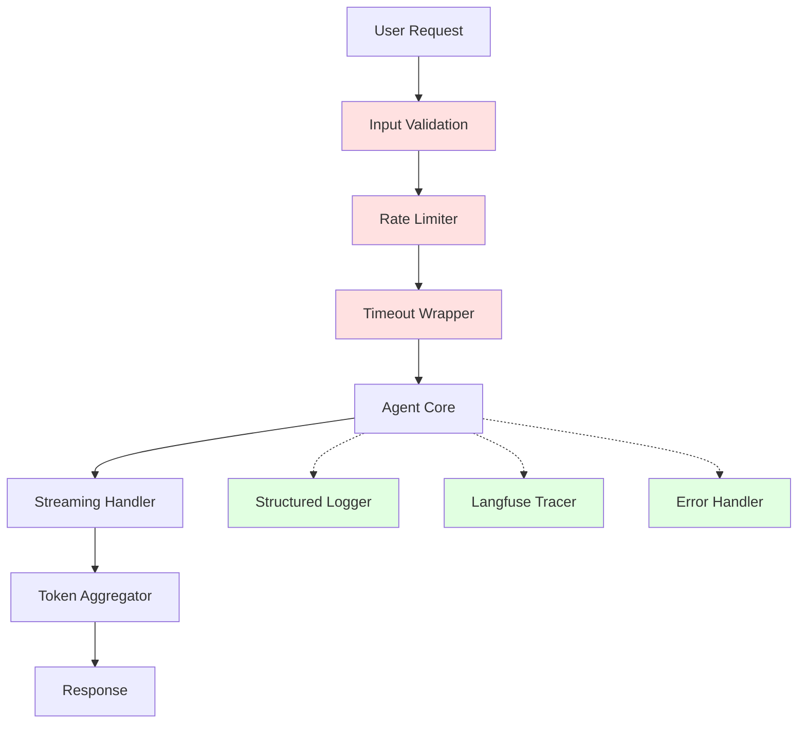
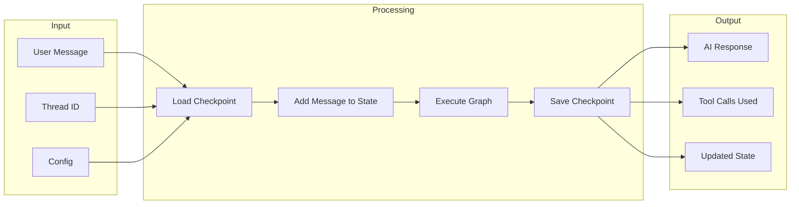
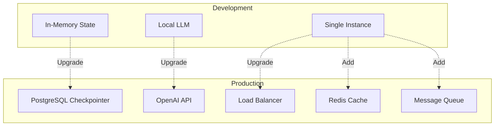

# System Architecture

This document provides a detailed architecture overview of the complete AI assistant built in Module 07.

## High-Level Architecture

## Detailed Component Breakdown

### 1. User Interfaces Layer

### 2. Agent Graph Flow

### 3. State Management

### 4. Tool Execution Flow

### 5. Production Features Stack

### 6. Data Flow

## Technology Stack

| Layer | Technology |
|-------|------------|
| **Graph Framework** | LangGraph |
| **LLM** | OpenAI GPT-4o-mini |
| **State Management** | MemorySaver / SqliteSaver |
| **Tools** | LangChain Tools (@tool decorator) |
| **Streaming** | astream_events (v2) |
| **UI** | Streamlit |
| **API** | FastAPI + Uvicorn |
| **Observability** | Langfuse / LangSmith |
| **Environment** | Python 3.10+, python-dotenv |

## Key Patterns Implemented

1. **ReAct Pattern**: Reasoning (LLM) + Acting (Tools) loop
2. **Checkpointing**: Persistent conversation state across sessions
3. **Streaming**: Real-time token delivery via async events
4. **HITL**: Human-in-the-loop with `interrupt()`
5. **Multi-threading**: Separate conversations via thread_id
6. **Rate Limiting**: Request throttling per user
7. **Input Validation**: Security against injection attacks
8. **Error Handling**: Graceful degradation with retries

## Scalability Considerations

---

For implementation details, see [Module 07: Complete Agent](07_complete_agent.md)
